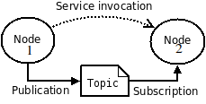
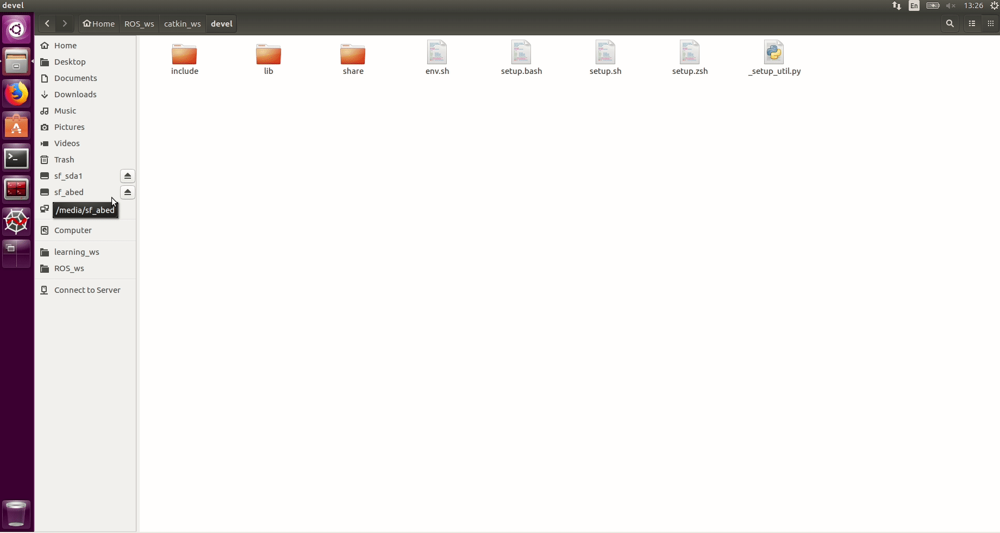

*******************
ROS Overview
*******************

Overview
========

Nodes are programs, a package is a collection of programs. ROS is based on nodes, that are processes that communicate with each others, send messages via topics. A topic is the bus where a message is sent.

The master, that can be run by ```roscore```, provides naming and registration services to the rest of nodes in the ROS system. When a node publish an information, using a message structure, it publish it on a topic. A node must subscribe to a topic in order to read that information. The master track publishers and subscribers.

Messages are data types or data structures, one can use ROS messages, ``std_msgs``, or create new one. User defined messages are stored in files with .msg extensions in the msg folder in the src folder of the workspace.

Topics are only one way buses, it mean if a node publish a topic, it doesn't wait an answer. If a node need to receive a reply from another node, services should be used.

.. _figLink:


As you can see node1 publish a message on a topic. Node2 receive the message on that topic. It is similar to the concepts of newsletters. If you are subscribed to it, you receive emails otherwise no. And evry topic should have a name.

Turtle sim
==============

In order to illustrate these concepts we will use the preinstalled package ``turtlesim``. Open 4 terminal or use a terminal multiplexer and run: ::

  // Terminal 1
  roscore

  // terminal 2
  rosrun turtlesim turtlesim_node

  // teminal 3
  rosrun turtlesim turtle_teleop_key

  // terminal 4
  rqt_graph

In the graph we can see that the node (process) ``teleop_turtle`` is publishing on a topic called ``cmd_vel``. The node ``turtlesim`` is receiving from the topic ``cmd_vel``.

In another terminal run: ::

  rostopic list

  rostopic info /turtle1/cmd_vel

``rostopic list`` show all list of topics that are active. ``rostopic info`` show the type of message that is published on the topic. We can see that on ``cmd_vel`` is being published a message of type ``geometry_msgs/Twist``.

Run the follwing command: ::

  rosmsg show geometry_msgs/Twist

you will get the data structure of the ``Twist`` message. ``A Twist`` is message that contain 2 variables ``linear`` and ``angular`` of type ``geometry_msgs/Vector3``. A ``geometry_msgs/Vector3`` type contain 3 variables ``x``, ``y``, ``z`` of type ``float64``.

Simply a ``geometry_msgs/Twist`` is a data structure that can be used to write linear and angular speed. So on topic ``cmd_vel`` the ``teleop_turtle`` node is sending the desired speed to ``turtlesim`` node.


The speed can be sent to the turtle from any other node that publish on the ``/turtle1/cmd_vel`` topic. For example if you open ``rqt`` ::

  rqt

Then from plugin, Robot tools, Robot steering, we can control the speed of the turtle.

.. _figLink:

