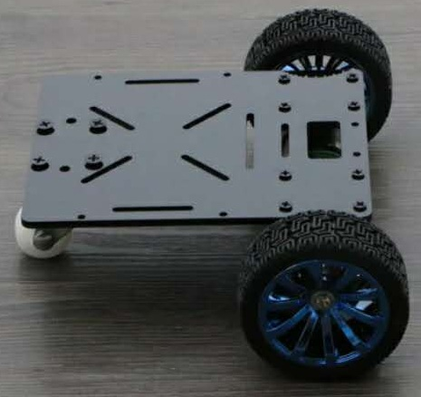
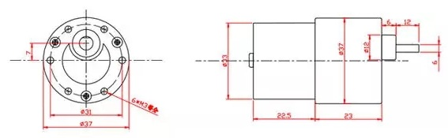

*********************
Mobile robot
*********************

In this chapter a mobile robot model will be defined. Refer to Gazebo chapter for simulation.

::

  catkin_create_pkg mobile_car_description geometry_msgs urdf rviz xacro

  cd mobile_car_description

  mkdir launch urdf meshes rviz scripts

The robot that we will use is shown in the following images. It is bought from taobao.com.

.. figure:: images/mobile/components.jpg
    :align: center
    :figwidth: 400px

The mobile robot or small car, have:
  - 2x dc motors with quadrature encoders
  - 2x Wheels
  - 1x castor wheel
  - 2x plates

Preparation
===============

Writing urdf or xacro file is time consuming and wasting. For this reason we will define different folders and files. ::

  mkdir motor wheel

Every folder will contain macro definition, configuration and test xacro files. It will contain a folder calles steps where every step of the model creation is saved.

In the ``urdf`` directory we will create a file called ``define.xacro`` where we define constants, colors and any thing else in order to avoid code duplication.

Different script will be written to speed up the testing.

Motors
========
As exersice we can write the model of the motor where mechanical dimensions are shown in the following image:

The final model will be like this:

.. figure:: images/mobile/motor_rviz.png
    :align: center
    :figwidth: 400px

We will not discuss the creation of this model because we will not use it. It is better to import a mesh file.

:download:`Download motor.xacro <../../../code/Robots/mobile_car_description/urdf/motor.xacro>`

Wheels
=======

Body
=====

Mechanical dimensions are shown in the following image:

.. figure:: images/mobile/car_mech1.jpg
    :align: center
    :figwidth: 400px

So mainly the body is a box. We will define also 2 brackets where the wheels are mounted.

Meshes
========

Gazebo
========

.. code:: xml

  <!-- Differential drive controller  -->
  <gazebo>
    <plugin name="differential_drive_controller" filename="libgazebo_ros_diff_drive.so">

      <rosDebugLevel>Debug</rosDebugLevel>
      <publishWheelTF>false</publishWheelTF>
      <robotNamespace>/</robotNamespace>
      <publishTf>1</publishTf>
      <publishWheelJointState>false</publishWheelJointState>
      <alwaysOn>true</alwaysOn>
      <updateRate>100.0</updateRate>

      <leftJoint>left_wheel_joint</leftJoint>
      <rightJoint>right_wheel_joint</rightJoint>

      <wheelSeparation>${base_width}</wheelSeparation>
      <wheelDiameter>${2*wheel_radius}</wheelDiameter>
      <broadcastTF>1</broadcastTF>
      <wheelTorque>30</wheelTorque>
      <wheelAcceleration>1.8</wheelAcceleration>
      <commandTopic>cmd_vel</commandTopic>
      <odometryFrame>odom</odometryFrame>
      <odometryTopic>odom</odometryTopic>
      <robotBaseFrame>base_link</robotBaseFrame>

    </plugin>

  </gazebo>

Hokuyo laser scanner
======================
